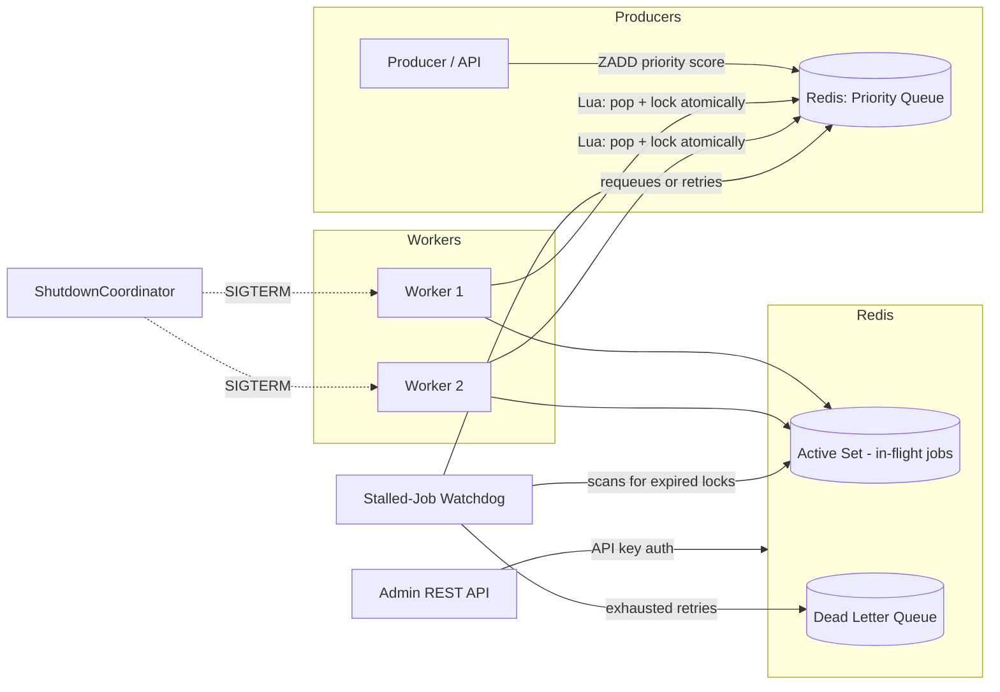

<div align="center">

# ⚓ Charon

### A Redis-backed distributed job queue with atomic guarantees, built for correctness under failure.

[](https://nodejs.org/)
[](https://redis.io/)
[](LICENSE)
[]()

*In Greek mythology, Charon ferries souls across the Styx — no passenger is lost, none arrives twice. This queue is built on the same principle: every job is processed exactly once, even when workers crash mid-transit.*

</div>

---

## Why Charon exists

Most "job queue" side projects wrap `Bull` or `BullMQ` and call it a day. Charon is different — it's a **from-scratch implementation of the primitives those libraries hide from you**: atomic job claiming, crash recovery, and backpressure, built directly on Redis using Lua scripting instead of client-side locking.

The goal wasn't to reinvent Bull. It was to understand — and be able to defend, line by line — *why* distributed queues are hard: race conditions between workers, jobs lost to crashed processes, retry storms, and the fact that "exactly-once" processing is basically a myth unless you design for it explicitly.

This README documents not just what Charon does, but the failure modes it was built to survive.

---

## Table of Contents

- [Architecture](#architecture)
- [Core Guarantees](#core-guarantees)
- [Features](#features)
- [Design Decisions & Tradeoffs](#design-decisions--tradeoffs)
- [Tech Stack](#tech-stack)
- [Getting Started](#getting-started)
- [Admin API](#admin-api)
- [Failure Scenarios Handled](#failure-scenarios-handled)
- [Roadmap](#roadmap)
- [License](#license)

---

## Architecture



**Flow summary:**
1. Producers push jobs onto a Redis-backed priority queue (sorted set, scored by priority + timestamp).
2. Workers atomically pop-and-lock a job using a single Lua script — eliminating the check-then-act race condition that plagues naive `GET`/`SET` based locking.
3. In-flight jobs live in an "active" sorted set with a lock expiry timestamp.
4. A watchdog process periodically scans the active set for jobs whose lock has expired (i.e., the worker died mid-processing) and requeues them for retry.
5. Jobs that exceed their retry budget move to a dead-letter queue instead of retrying forever.
6. A `ShutdownCoordinator` intercepts `SIGTERM`/`SIGINT` so in-flight jobs finish before the process exits — no jobs silently dropped on deploy.

---

## Core Guarantees

| Guarantee | How it's enforced |
|---|---|
| **No two workers process the same job simultaneously** | Atomic Lua script combines the pop and lock into a single Redis operation — no window for a race between two workers reading the same job. |
| **Crashed workers don't lose jobs** | Stalled-job watchdog detects expired locks in the active set and requeues automatically. |
| **Failing jobs don't retry forever** | Exponential backoff with a capped retry count, after which jobs move to the DLQ for manual inspection. |
| **No job loss on deploy/restart** | `ShutdownCoordinator` drains in-flight work before allowing process exit on `SIGTERM`. |
| **Priority is respected under load** | Sorted-set based queue, not a FIFO list — high-priority jobs are always popped first regardless of insertion order. |

---

## Features

- **Atomic job claiming via Lua scripting** — the pop-and-lock operation is a single round-trip to Redis, executed server-side, making it inherently race-free without needing distributed locks like Redlock.
- **Priority queues** — jobs are scored and ordered, so critical work isn't starved by a backlog of low-priority jobs.
- **Retry logic with exponential backoff** — failed jobs are retried with increasing delay, reducing load on downstream services during outages instead of hammering them.
- **Dead-letter queue (DLQ)** — jobs that exhaust retries are isolated for inspection instead of being silently dropped or retried indefinitely.
- **Stalled-job watchdog** — a background sweeper that detects jobs whose worker died mid-processing (via lock TTL expiry) and recovers them.
- **Graceful shutdown (`ShutdownCoordinator`)** — listens for termination signals and lets active jobs complete before the process exits, avoiding data loss during deploys.
- **Bulk enqueue** — batch job insertion to avoid N round-trips to Redis for N jobs.
- **Horizontal scalability** — multiple worker instances can run concurrently against the same queue with no coordination overhead beyond Redis itself.
- **REST Admin API** — API-key-authenticated endpoints for inspecting queue depth, DLQ contents, and job status, without needing direct Redis access.
- **Observability via RedisInsight** — Dockerized RedisInsight setup for visually inspecting queue state, active locks, and DLQ contents during development.

---

## Design Decisions & Tradeoffs

*(This is usually the section that separates a tutorial-follower from someone who actually understands distributed systems — so it's worth reading if you're evaluating this project.)*

**Why Lua scripting instead of a Redlock-style distributed lock?**
Redlock is designed for locking a resource across multiple independent Redis nodes. Charon's problem is simpler: *within a single Redis instance*, avoid two workers popping the same job. A Lua script is atomic by default in Redis (single-threaded execution), so it fully solves the race condition without the added complexity, latency, and disputed correctness guarantees of Redlock.

**Why a sorted set instead of a Redis List (`LPUSH`/`RPOP`) for the queue?**
Lists give you strict FIFO — no way to express priority without external bookkeeping. A sorted set lets the score encode priority and insertion order together, so `ZPOPMIN`-style logic naturally returns the highest-priority, oldest job first, in one operation.

**Why detect stalled jobs via lock expiry instead of heartbeats?**
Heartbeats require the worker to actively check in, which fails silently in exactly the scenario you're trying to protect against — a worker that's already dead can't send a heartbeat. A TTL-based lock means recovery doesn't depend on the failed component doing anything; the watchdog independently detects the absence of renewal.

**Why exponential backoff instead of fixed-interval retries?**
Fixed-interval retries on a failing downstream dependency amplify load exactly when the system is already struggling. Exponential backoff spaces out retries as failures persist, giving the downstream system room to recover instead of being retried into deeper failure.

**Trade-off accepted:** Charon assumes a single Redis instance (or a Redis Cluster-compatible key design) rather than solving multi-datacenter consensus. This was a deliberate scope decision — the goal was to master single-node queue correctness deeply, not to rebuild a Redlock-grade multi-node consensus protocol from scratch.

---

## Tech Stack

| Layer | Choice | Reasoning |
|---|---|---|
| Runtime | Node.js | Non-blocking I/O suits queue polling and concurrent job dispatch |
| Data store / broker | Redis | In-memory speed, native sorted sets, and Lua scripting for atomicity |
| Atomicity | Lua (via `EVAL`) | Guarantees pop+lock happens as one indivisible operation |
| Admin interface | REST API + API key auth | Lightweight, framework-agnostic access to queue internals |
| Observability | RedisInsight (Docker) | Visual inspection of queue/lock/DLQ state during development |

---

## Getting Started

```bash
# Clone the repo
git clone https://github.com/mehrotra-raj/charon.git
cd charon

# Install dependencies
npm install

# Start Redis (via Docker)
docker run -d -p 6379:6379 redis:7

# Start a worker
npm run worker

# Start the admin API
npm run admin
```

**Environment variables:**
```env
REDIS_URL=redis://localhost:6379
ADMIN_API_KEY=your-secret-key
MAX_RETRIES=5
LOCK_TTL_MS=30000
```

---

## Admin API

| Endpoint | Method | Description |
|---|---|---|
| `/api/queue/status` | `GET` | Current queue depth, active jobs, DLQ count |
| `/api/queue/jobs/:id` | `GET` | Inspect a specific job's state and retry history |
| `/api/dlq` | `GET` | List all dead-lettered jobs |
| `/api/dlq/:id/retry` | `POST` | Manually requeue a job from the DLQ |
| `/api/enqueue` | `POST` | Submit a job (supports bulk array payload) |

All admin endpoints require an `x-api-key` header matching `ADMIN_API_KEY`.

---

## Failure Scenarios Handled

| Scenario | Behavior |
|---|---|
| Worker crashes mid-job | Lock expires → watchdog requeues the job automatically |
| Two workers race for the same job | Lua script guarantees only one succeeds in claiming it |
| Downstream service is down | Exponential backoff spaces out retries instead of hammering it |
| Job fails repeatedly | Moved to DLQ after max retries — never retried forever |
| Process receives `SIGTERM` (e.g. deploy) | `ShutdownCoordinator` waits for active jobs to finish before exit |
| Sudden burst of jobs | Bulk enqueue avoids N round-trips; priority queue prevents starvation of urgent jobs |

---

## Roadmap

- [ ] Redis Cluster support for horizontal broker scaling
- [ ] Prometheus metrics exporter for queue depth / throughput
- [ ] Job scheduling (delayed/cron-style jobs)
- [ ] Web dashboard on top of the Admin API

---

## License

MIT — free to use, modify, and learn from.

---

<div align="center">
<sub>Built to understand distributed systems from first principles, not to wrap an existing library.</sub>
</div>
